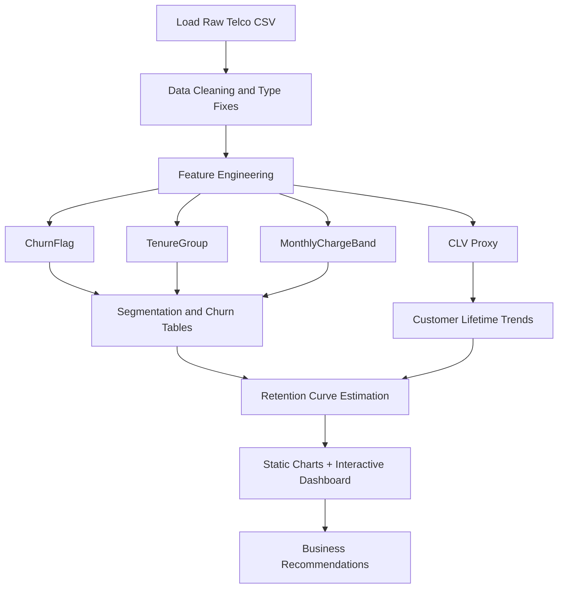
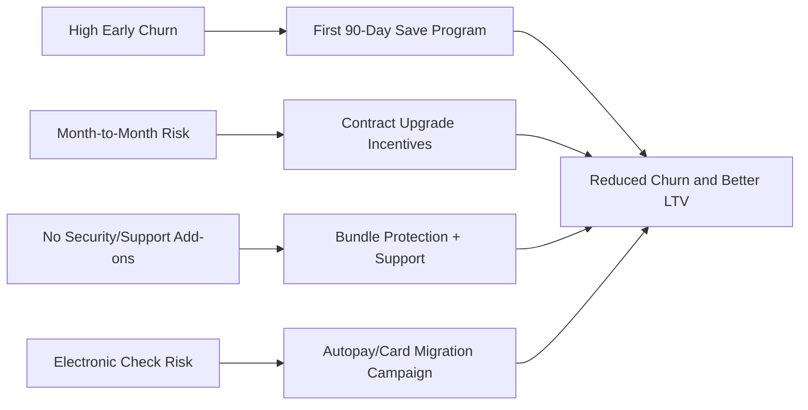
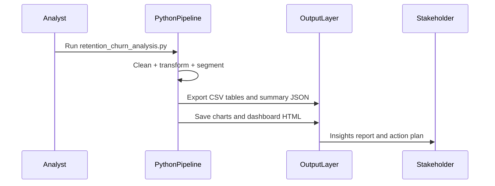

# Customer Retention & Churn Analysis


A business-focused retention analytics project on the Telco churn dataset to identify churn patterns, retention drivers, and customer lifetime trends for a subscription-style service.

## 1. Objective
This project answers high-impact business questions:

- Why are customers leaving?
- Which segments churn the most?
- How retention changes with tenure/cohort proxies?
- What actions can reduce customer loss and protect recurring revenue?

## 2. Business Outcomes (From This Analysis)
- **Overall churn rate:** 26.54%
- **Customers analyzed:** 7,043
- **Avg tenure:** 32.37 months
- **Avg tenure (churned):** 17.98 months
- **Avg tenure (retained):** 37.57 months
- **Estimated 12-month retention:** 84.32%
- **Estimated 24-month retention:** 78.87%

## 3. Top Churn Risk Signals
- `TenureGroup = 0-3m`: 56.21% churn
- `PaymentMethod = Electronic check`: 45.29% churn
- `Contract = Month-to-month`: 42.71% churn
- `InternetService = Fiber optic`: 41.89% churn
- `OnlineSecurity = No`: 41.77% churn
- `TechSupport = No`: 41.64% churn
- `SeniorCitizen = Yes`: 41.68% churn

## 4. Tech Stack
| Layer | Tools | Purpose |
|---|---|---|
| Data Processing | Python, Pandas, NumPy | Cleaning, feature engineering, segmentation |
| Visualization | Matplotlib, Seaborn | Static KPI charts |
| Dashboard | Plotly (HTML) | Interactive decision dashboard |
| Reporting | Markdown, JSON, CSV | Stakeholder-ready deliverables |

## 5. Project Structure
```text
DS2/
  data/
    raw/
      telco_customer_churn.csv
  outputs/
    figures/
      churn_by_contract.png
      churn_by_tenure_group.png
      churn_heatmap_contract_internet.png
      retention_curve.png
    tables/
      churn_by_contract.csv
      churn_by_internetservice.csv
      churn_by_onlinesecurity.csv
      churn_by_paymentmethod.csv
      churn_by_seniorcitizen.csv
      churn_by_techsupport.csv
      churn_by_tenuregroup.csv
      cleaned_dataset.csv
      retention_curve.csv
    retention_dashboard.html
    retention_analysis_report.md
    summary_metrics.json
  scripts/
    retention_churn_analysis.py
  architecture.md
  projectdocumentation.md
  README.md
```

## 6. End-to-End Analysis Flow


## 7. Retention Decision Logic


## 8. Delivery Pipeline


## 9. Setup and Run
1. Open workspace root.
2. Install dependencies:

```bash
pip install pandas numpy matplotlib seaborn plotly kaleido
```

3. Run analysis:

```bash
python scripts/retention_churn_analysis.py
```

4. Open outputs:
- `outputs/retention_dashboard.html`
- `outputs/retention_analysis_report.md`
- `outputs/summary_metrics.json`

## 10. Key Deliverables for Task 2
- Interactive retention dashboard (`outputs/retention_dashboard.html`)
- Churn/retention report (`outputs/retention_analysis_report.md`)
- Exportable churn tables (`outputs/tables/*.csv`)
- Visual evidence pack (`outputs/figures/*.png`)

## 10A. Dashboard Access
- Live dashboard (GitHub Pages): https://ramalokeshreddyp.github.io/FUTURE_DS_02/
- Local dashboard file: `outputs/retention_dashboard.html`

## 10B. Task 2 Requirement Coverage
| Task Requirement | Implemented In This Project | Evidence |
|---|---|---|
| Analyze churn patterns | Segment churn analysis by contract, tenure, payment, service profile | `outputs/tables/churn_by_*.csv`, `outputs/figures/churn_by_*.png` |
| Identify key retention drivers | Uplift-based risk segment ranking and retention driver interpretation | `outputs/summary_metrics.json`, `outputs/retention_analysis_report.md` |
| Customer lifetime trends | Tenure comparisons, CLV proxy, retained vs churned behavior | `outputs/tables/cleaned_dataset.csv`, `outputs/retention_analysis_report.md` |
| Cohort/retention analysis | Tenure-cohort proxy framework and Kaplan-Meier style retention curve | `outputs/tables/retention_curve.csv`, `outputs/figures/retention_curve.png` |
| Dashboard/report deliverable | Interactive Plotly dashboard + markdown report | `outputs/retention_dashboard.html`, `outputs/retention_analysis_report.md` |
| Actionable recommendations | Business strategy section with concrete churn-reduction actions | `README.md`, `outputs/retention_analysis_report.md` |
| Public GitHub and deployment | Repository with GitHub Actions and Pages deployment workflow | `.github/workflows/deploy-dashboard.yml` |

## 11. Actionable Recommendations
1. **Protect first 6 months:** Deploy onboarding nudges, activation tracking, and proactive outreach for new users.
2. **Reduce month-to-month volatility:** Offer annual-plan discount ladders and price-lock offers.
3. **Bundle retention add-ons:** Promote security + tech support bundles where churn is concentrated.
4. **Optimize billing rails:** Move high-risk electronic-check users to autopay/card.
5. **Segmented retention campaigns:** Prioritize high-risk cohorts by tenure and service profile.

## 12. Portfolio and Submission Tip
For Future Interns submission, include this repository with dashboard screenshots and post key outcomes on LinkedIn with:
- Problem statement
- Metrics improved/identified
- Tools and methods used
- Business recommendations

## 13. Submission Checklist (Future Interns)
- Public GitHub repository with complete source and outputs
- README with objective, methods, insights, and links
- Architecture and technical documentation files
- Dashboard/report artifact ready for stakeholder review
- LinkedIn post summarizing problem, approach, and insights
- Tag and follow: https://www.linkedin.com/company/future-interns/
