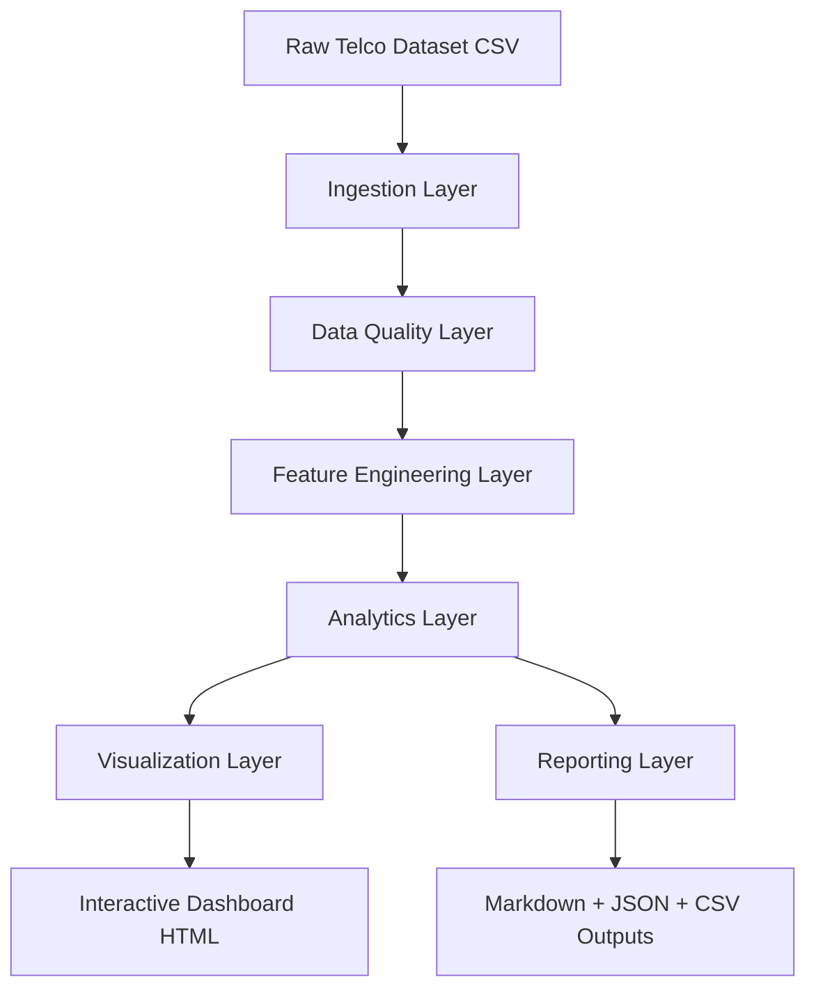
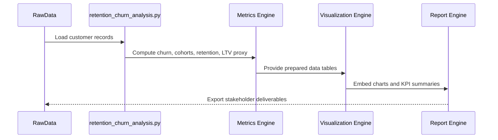

# System Architecture - Customer Retention & Churn Analysis

## 1. Architecture Overview
This solution uses a modular analytics pipeline to transform customer subscription records into retention intelligence.

## 2. Module Breakdown
| Module | Responsibility | Output |
|---|---|---|
| Ingestion | Load CSV and schema check | DataFrame |
| Data Quality | Handle blanks, convert numeric types, normalize categories | Cleaned dataset |
| Feature Engineering | Churn flag, tenure cohorts, charge bands, CLV proxy | Analytical features |
| Analytics | Segment churn rates, retention curve, lifetime metrics | KPI tables and model-ready metrics |
| Visualization | Build static and interactive visuals | PNG charts and HTML dashboard |
| Reporting | Summaries and recommendations | Markdown and JSON business report |

## 3. Component Interaction

## 4. Data Flow Design
1. Input file is read from `data/raw/telco_customer_churn.csv`.
2. Numeric columns (`tenure`, `MonthlyCharges`, `TotalCharges`) are sanitized.
3. Derived fields are generated:
- `ChurnFlag`
- `TenureGroup`
- `MonthlyChargeBand`
- `CLVProxy`
4. Segment tables and survival-style retention estimates are computed.
5. Outputs are materialized into:
- `outputs/tables/*.csv`
- `outputs/figures/*.png`
- `outputs/retention_dashboard.html`
- `outputs/retention_analysis_report.md`
- `outputs/summary_metrics.json`

## 5. Retention Model Logic
Since the dataset is a cross-sectional snapshot (without explicit signup date), the architecture uses:

- **Tenure-based cohort proxies** to approximate lifecycle stages.
- **Kaplan-Meier style retention estimation** from tenure duration and churn event.
- **Segment uplift analysis** to rank churn-risk drivers by relative impact.

## 6. Design Rationale
- Python is chosen for reproducible, scriptable, and portfolio-ready analysis.
- Plotly HTML dashboard enables easy sharing without BI server dependencies.
- CSV/JSON outputs preserve downstream compatibility with Excel or Power BI.

## 7. Scalability Considerations
- Current pipeline is single-node and suitable for small/medium data.
- For larger scale, architecture can evolve to:
1. Batch orchestrators (Airflow/Prefect)
2. Warehouse-backed SQL transformations
3. Feature store for retention modeling
4. BI refresh pipelines (Power BI/Tableau)

## 8. Strengths and Trade-offs
### Strengths
- Fast to run and easy to reproduce
- Business-readable outputs
- Good balance of descriptive and retention-lifecycle analytics

### Trade-offs
- No true signup-date cohort matrix due to dataset limitations
- CLV metric is proxy-based, not discounted cashflow LTV
- Causal churn inference is not guaranteed (observational data)

## 9. Production Readiness Path
To productionize this architecture:
1. Add data validation checks (missingness drift, schema contracts).
2. Schedule recurring pipeline execution.
3. Add alerting for churn spikes and segment anomalies.
4. Integrate CRM actions (campaign triggers for high-risk users).
5. Add predictive churn scoring and uplift-based intervention testing.
