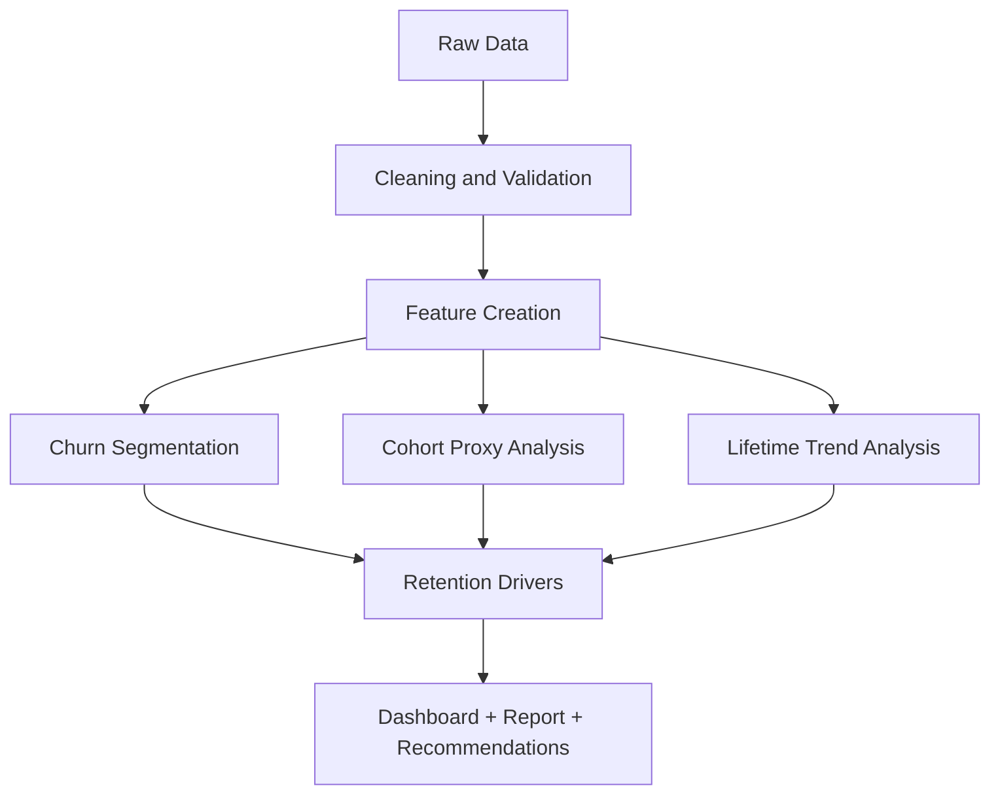
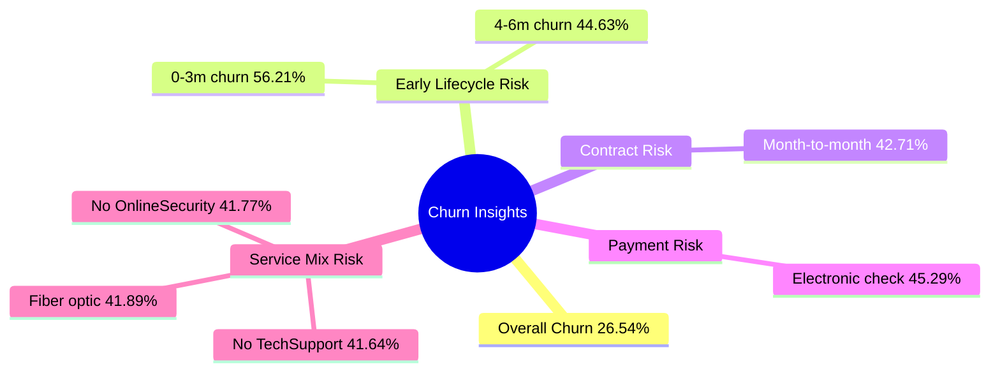

# Project Documentation - Customer Retention & Churn Analysis

## 1. Project Objective
Build a real-world retention analytics deliverable for a subscription business to identify:

- churn patterns,
- retention drivers,
- customer lifetime behavior,
- and practical interventions to reduce customer loss.

## 2. Problem Context
In subscription models, churn directly affects growth and recurring revenue. The project is designed as a stakeholder-facing analysis for product/growth teams and startup founders.

## 3. Dataset
- Source: Telco Customer Churn dataset
- Records: 7,043 customers
- Features: demographics, services, billing profile, tenure, charges, and churn status

## 4. Workflow

## 5. Data Preparation and Cleaning
Steps implemented:
1. Trimmed categorical strings to remove hidden spacing issues.
2. Converted `tenure`, `MonthlyCharges`, and `TotalCharges` to numeric.
3. Resolved missing `TotalCharges` values using `MonthlyCharges * tenure` fallback.
4. Generated binary `ChurnFlag` from the target label.

## 6. Feature Engineering
Created analytical features:

- `TenureGroup`: lifecycle bins (`0-3m`, `4-6m`, `7-12m`, `13-24m`, `25-48m`, `49-72m`)
- `MonthlyChargeBand`: low/mid/high fee grouping
- `CLVProxy`: `MonthlyCharges * tenure`

These features support interpretable cohort and retention diagnostics.

## 7. Analysis Methods
### 7.1 Churn Pattern Analysis
Calculated segment-level churn rates by:
- contract type,
- payment method,
- internet service,
- support/security add-ons,
- senior citizen status,
- tenure bands.

### 7.2 Cohort and Retention Analysis
Because signup month is unavailable, tenure-group cohorts are used as lifecycle proxies.

A Kaplan-Meier style retention estimate is computed using:
- duration = tenure,
- event = churn flag.

### 7.3 Customer Lifetime Trends
Compared churned vs retained customers on:
- average tenure,
- monthly revenue contribution,
- cumulative billing proxy (`CLVProxy`).

## 8. Key Findings

Business highlights:
- Churn is heavily concentrated in early tenure cohorts.
- Contract structure is a major retention lever.
- Add-on services (security/support) correlate with lower churn.
- Payment method behavior is strongly associated with churn risk.

## 9. Output Artifacts
Generated files:
- Interactive dashboard: `outputs/retention_dashboard.html`
- Detailed report: `outputs/retention_analysis_report.md`
- KPI summary: `outputs/summary_metrics.json`
- Charts: `outputs/figures/*.png`
- Analytical tables: `outputs/tables/*.csv`

## 10. Recommendations and Decision Strategy
1. Launch a first-90-day retention playbook for new customers.
2. Shift month-to-month users into 1-year and 2-year contracts via personalized offers.
3. Bundle and promote OnlineSecurity + TechSupport in high-risk segments.
4. Reduce electronic-check usage through autopay/card incentives.
5. Monitor retention by tenure cohort weekly and track campaign lift.

## 11. Testing and Validation Approach
Validation steps performed:
- Script re-run for deterministic output generation.
- Warning-free execution after explicit groupby behavior control.
- Output sanity checks for rates, counts, and file generation.

Recommended next validations:
1. Holdout-period validation on newer snapshots.
2. A/B tests for interventions (pricing, onboarding, support bundles).
3. Build churn prediction and uplift models for prioritization.

## 12. Production Readiness Assessment
Current state is analytics-ready and portfolio-ready.

To become production-grade:
- automate scheduled data pulls,
- add CI for data checks and report tests,
- integrate churn-risk triggers with CRM workflows,
- monitor KPI drift and campaign ROI.

## 13. Conclusion
The project demonstrates practical retention analytics with clear business impact:

- quantified churn risk,
- identified retention drivers,
- measured lifecycle trends,
- and translated findings into an actionable churn-reduction strategy.

This aligns directly with real SaaS/growth analytics workflows and stakeholder expectations.
